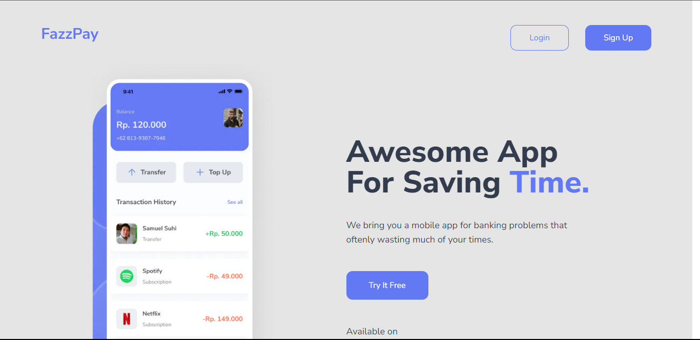
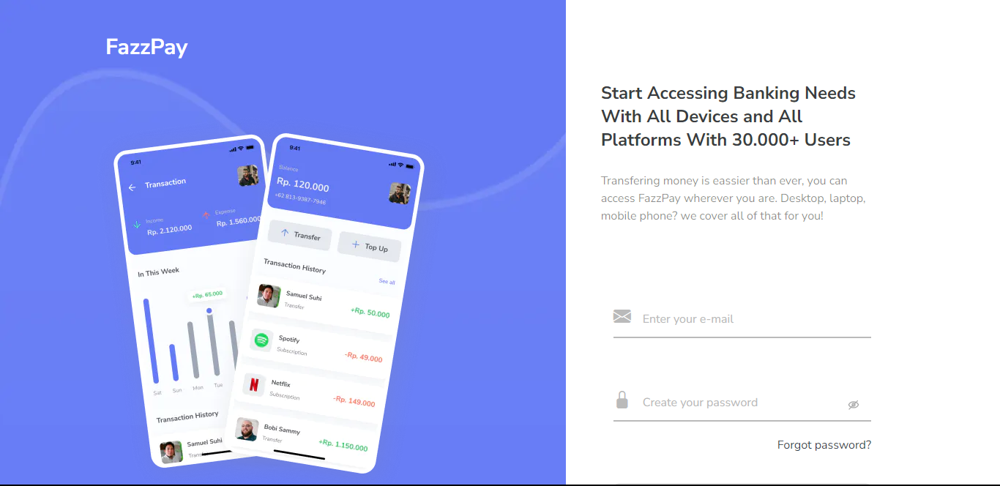
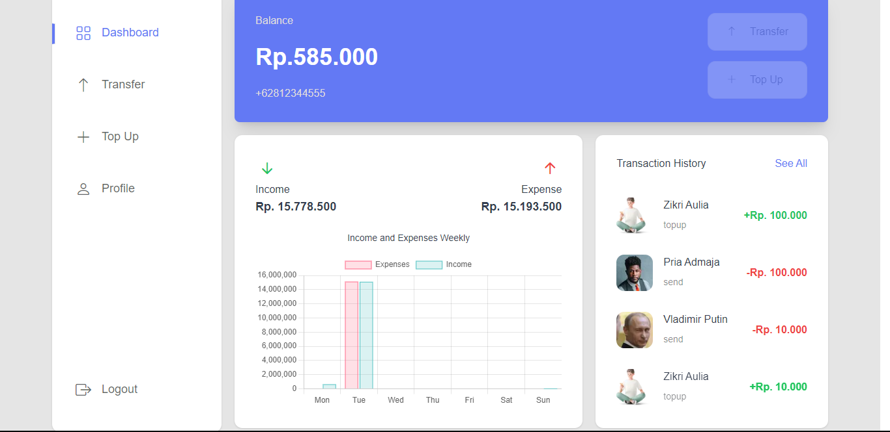
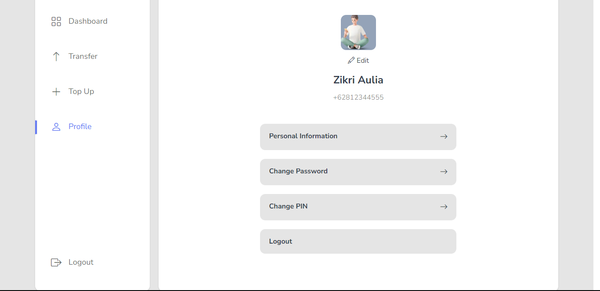
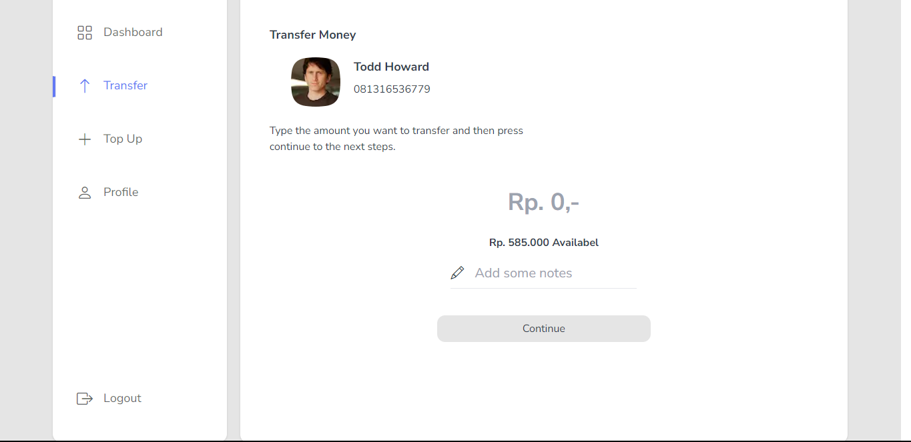
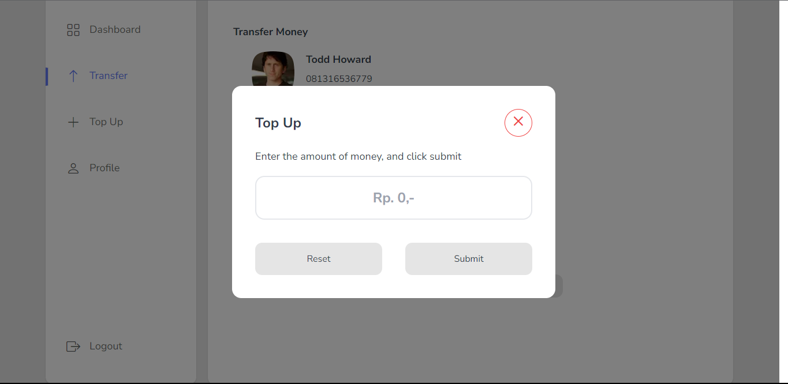

<a id="readme-top"></a>

<!-- PROJECT LOGO -->
<br />
<div align="center">
  <a href="#">
    
  </a>

  <h2 align="center">FAZZPAY E-WALLET</h2>

  <p>Translate The e-wallet website is a digital platform for electronic financial transactions. Users can store, send, and receive money electronically. They can fill in the e-wallet balance and use different payment methods. Financial and security management features are also provided. The main objective of this project is to provide a comfortable and efficient transaction experience.</p>

  <p align="center">
    <a href="https://microjecto-fazzpay.vercel.app/">View Demo</a>
    ·
    <a href="mailto:zikriaulia98@gmail.com">Report Bug</a>
    ·
    <a href="mailto:zikriaulia98@gmail.com">Request Feature</a>
  </p>
</div>

## Built With

<p align="center">
  <a href="https://skillicons.dev">
    
  </a>
</p>

<p align="right">(<a href="#readme-top">back to top</a>)</p>

## Contents

- [Features](#features)
- [Run Application](#how-to-run-the-application)
- [Deployment](#deployment)
- [Related Projects](#related-projects)
- [Contributors](#contributors)

## Features

### Public

- Login
- Register
- Forgot Password
- Transfer
- Transfer History
- Edit Profile
- Dashboard
- Etc

## How to Run the Application

### 1. Clone this repository

Clone this repository by run the following code:

```
$ git clone https://github.com/zikriaulia28/Microjecto.git
```

### 2. Install dependency packages

Install dependency packages by run the following code inside project folder:

```
$ npm install
```

### 3. Configure .env file

Configure .env file by create file named .env inside project folder and add this line to the file:

```
NEXT_PUBLIC_ANALYTICS_ID = "https://fazzpay-rose.vercel.app/""

```

### 4. Run projects

Run this projects by run the following code:

```
$ npm run dev
```

It runs the app in the development mode.\
Open [http://localhost:3000](http://localhost:3000) to view it in your browser.

The page will reload when you make changes.\
You may also see any lint errors in the console.

## Contributing

1. Fork the Project
2. Create your new Branch ( `git checkout -b ...` )
3. Commit your Changes ( `git commit -m '...'` )
4. Push to the Branch ( `git push origin ...` )
5. Open a Pull Request

<p align="right">(<a href="#readme-top">back to top</a>)</p>

## Deployment

[Vercel deploy Link](https://microjecto-fazzpay.vercel.app/)

<p align="right">(<a href="#readme-top">back to top</a>)</p>

## Documentation

<div style="display: flex; flex-wrap: wrap; gap: 1%;">


</div>
<div style="display: flex; flex-wrap: wrap; gap: 1%;">


</div>
<div style="display: flex; flex-wrap: wrap; gap: 1%;">


</div>
